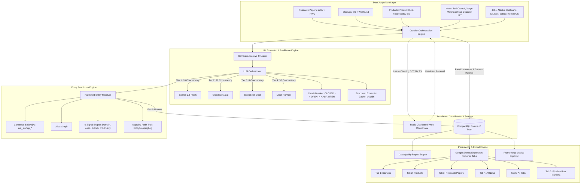

# System Architecture & Component Flow

```mermaid
graph TD
    subgraph Data Acquisition Layer
        A1[Research Papers: arXiv + PWC] --> C[Crawler Orchestration Engine]
        A2[Startups: YC + Wellfound] --> C
        A3[Products: Product Hunt, Futurepedia, etc.] --> C
        A4[News: TechCrunch, Verge, MarkTechPost, Decoder, MIT] --> C
        A5[Jobs: AIJobs, Wellfound, MLJobs, Jobicy, RemoteOK] --> C
    end

    subgraph Distributed Coordination & Storage
        C -->|Lease Claiming SET NX EX| R[Redis Distributed Work Coordinator]
        R -->|Heartbeat Renewal| C
        C -->|Raw Documents & Content Hashes| PG[(PostgreSQL Source of Truth)]
    end

    subgraph LLM Extraction & Resilience Engine
        C --> CH[Semantic Adaptive Chunker]
        CH --> LLM[LLM Orchestrator]
        LLM -->|Tier 1: 10 Concurrency| G[Gemini 2.5 Flash]
        LLM -->|Tier 2: 20 Concurrency| GR[Groq Llama 3.3]
        LLM -->|Tier 3: 8 Concurrency| DS[DeepSeek Chat]
        LLM -->|Tier 4: 50 Concurrency| M[Mock Provider]
        LLM --> CB[Circuit Breaker: CLOSED -> OPEN -> HALF_OPEN]
        LLM --> CACHE[Structured Extraction Cache: sha256]
    end

    subgraph Entity Resolution Engine
        LLM --> ER[Hardened Entity Resolver]
        ER --> ID[Canonical Entity IDs: ent_startup_*]
        ER --> AG[Alias Graph]
        ER --> MS[6-Signal Engine: Domain, Alias, GitHub, YC, Fuzzy]
        ER --> AUDIT[Mapping Audit Trail: EntityMappingLog]
    end

    subgraph Persistence & Export Engine
        ER -->|Batch Upserts| PG
        PG --> DQR[Data Quality Report Engine]
        PG --> EXP[Google Sheets Exporter: 6 Required Tabs]
        EXP --> S1[Tab 1: Startups]
        EXP --> S2[Tab 2: Products]
        EXP --> S3[Tab 3: Research Papers]
        EXP --> S4[Tab 4: AI News]
        EXP --> S5[Tab 5: AI Jobs]
        EXP --> S6[Tab 6: Pipeline Run Manifest]
        PG --> MET[Prometheus Metrics Exporter]
    end
```
